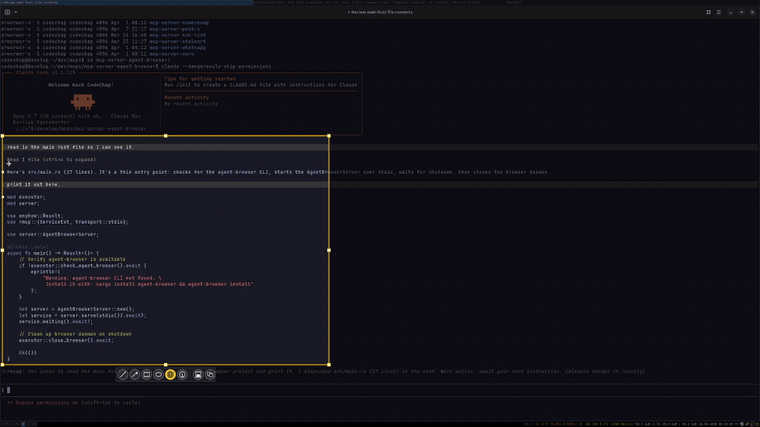

# RustShot



Fast Rust screenshot tool for Linux + X11 (i3-friendly). A from-scratch port of [Flameshot](https://github.com/flameshot-org/flameshot)'s core workflow: drag a region, annotate, save and/or copy to clipboard — driven by a long-running daemon so each PrintScreen is a fast IPC call instead of a cold binary start.

- [Status](#status)
- [Features](#features)
- [Install](#install)
- [Usage](#usage) — [daemon](#run-the-daemon) · [captures](#trigger-captures) · [shortcuts](#overlay-shortcuts)
- [i3 setup](#i3-setup)
- [systemd autostart](#systemd-autostart-alternative-to-i3-exec) — [troubleshooting](#troubleshooting)
- [Configuration](#configuration)
- [DBus interface](#dbus-interface)
- [Architecture](#architecture)
- [Build from source](#build-from-source)
- [License](#license)

## Status

- **Linux + X11 only.** Developed and tested on i3wm. No Wayland, no Windows, no macOS.
- ~6 MB stripped release binary. Runtime deps: X11, and `xclip` (for the clipboard — `apt install xclip`).

## Features

- Drag-rect region selection with dimmed exterior
- Annotation tools: Pencil, Highlighter, Line, Arrow, Rect, Ellipse, Pixelate, Auto-counter (numbered marker)
- Undo / redo
- Save to disk, copy to clipboard, or both
- DBus-driven daemon → instant overlay on hotkey
- MIT-SHM fast-path blit (falls back to socket `PutImage` if unavailable)
- Optional X11 cursor compositing via XFixes
- TOML config: defaults, save dir, filename pattern

## Install

Requires a Rust toolchain (`rustup`).

```bash
git clone https://github.com/codeChap/RustShot.git
cd RustShot
cargo install --path .
```

This puts `rustshot` in `~/.cargo/bin/`.

## Usage

### Run the daemon

```bash
rustshot
```

Registers on the session DBus as `org.rustshot.RustShot` and waits for capture requests. Exits cleanly (status 0) if another instance already owns the bus name.

### Trigger captures

These CLI forms are for scripts and one-shots. For PrintScreen-style hotkeys, bind `dbus-send` against the running daemon — see [i3 setup](#i3-setup) below.

```bash
rustshot gui                 # interactive region select; auto-save to default path
rustshot gui -c              # auto-save + copy to clipboard
rustshot gui -p shot.png     # save to a specific path
rustshot gui -p shot.png -c  # save + clipboard
rustshot gui -c --no-save    # clipboard only, no disk write

rustshot full                # all monitors stitched, no UI
rustshot full -c             # all monitors → clipboard

rustshot screen              # the cursor's monitor, no UI
rustshot screen -n 1         # specific monitor by index
```

`-d MS` adds a delay before capture. `--no-save` skips the disk write (use with `-c` for clipboard-only flows).

### Overlay shortcuts

| Key            | Action                                 |
| -------------- | -------------------------------------- |
| Drag           | Select region (then enter Annotate)    |
| Drag inside    | Move the frame (when no tool is armed; also `Ctrl+drag` any time) |
| Drag a handle  | Resize the frame                       |
| `1`–`8`        | Pencil, Highlighter, Line, Arrow, Rect, Ellipse, Pixelate, Counter |
| `Ctrl+Z`/`Y`   | Undo / Redo                            |
| `Enter`        | Save                                   |
| `Ctrl+C`       | Copy to clipboard                      |
| `Esc`          | Cancel                                 |

The Auto-Counter tool single-clicks numbered bubbles that auto-increment per overlay session. Click the active tool button again (or create a new selection) to disarm it and return to frame-drag mode.

## i3 setup

Add to `~/.config/i3/config`:

```text
# Autostart the daemon (or use systemd, see below).
# The overlay is an override-redirect X11 window, so i3 doesn't need
# (or get) any for_window rules for it.
exec --no-startup-id rustshot

# PrintScreen → drag region → save (auto-path) + clipboard
# dbus-send (~40KB, always cache-hot) talks to the daemon directly.
# Bypasses a cold rustshot binary spawn that `rustshot gui -c` would
# otherwise do on every keypress. Same work, same code path as a tray click.
#
# Arg order for *Flags methods: path, delay_ms, clipboard, no_save, id.
# captureScreenFlags prepends int32 screen_index (-1 = cursor's screen).
bindsym Print exec --no-startup-id dbus-send --session \
    --dest=org.rustshot.RustShot --type=method_call / \
    org.rustshot.RustShot.graphicCaptureFlags \
    string:"" uint32:0 boolean:true boolean:false string:""

bindsym $mod+Print exec --no-startup-id dbus-send --session \
    --dest=org.rustshot.RustShot --type=method_call / \
    org.rustshot.RustShot.captureScreenFlags \
    int32:-1 string:"" uint32:0 boolean:true boolean:false string:""

bindsym $mod+Shift+Print exec --no-startup-id dbus-send --session \
    --dest=org.rustshot.RustShot --type=method_call / \
    org.rustshot.RustShot.fullScreenFlags \
    string:"" uint32:0 boolean:true boolean:false string:""
```

Reload with `i3-msg reload`. The first `boolean` is the clipboard flag (matches `-c`); the second is `no_save`. Flip either to change behavior.

The `rustshot gui` / `rustshot full` / `rustshot screen` CLI subcommands stay useful for one-shot scripting (`rustshot gui --delay 3 -p /tmp/foo.png`) where flag-parsing is convenient. For hot keybinds you skip the binary spawn entirely.

## systemd autostart (alternative to i3 `exec`)

```bash
mkdir -p ~/.config/systemd/user
cp data/systemd/rustshot.service ~/.config/systemd/user/
systemctl --user daemon-reload
systemctl --user enable --now rustshot.service
```

Check it's running: `systemctl --user status rustshot`.

The unit's `ExecStart` is `%h/.cargo/bin/rustshot`, matching `cargo install` — the binary lives on the root drive, so the service is independent of any external mounts (source tree location irrelevant).

**`WantedBy=default.target` (not `graphical-session.target`).** Under a bare i3/X11 session, nothing activates `graphical-session.target` for the user scope, so a unit bound to it is enabled-but-never-started on login. `default.target` always activates on user login and works under every login setup (i3, GNOME, KDE, tty).

### Troubleshooting

If PrintScreen does nothing and no tray icon appears after reboot:

```bash
systemctl --user is-active rustshot         # should print "active"
journalctl --user -u rustshot -n 50         # startup errors
```

If the unit is enabled but inactive, it was probably installed with the old `WantedBy=graphical-session.target`:

```bash
systemctl --user disable rustshot
cp data/systemd/rustshot.service ~/.config/systemd/user/
systemctl --user daemon-reload
systemctl --user enable --now rustshot.service
```

## Configuration

`~/.config/rustshot/config.toml` — sample at [`data/sample-config.toml`](data/sample-config.toml). All sections + keys are optional; missing values fall back to defaults.

Annotation color and stroke width are deliberately not configurable — the overlay is keyboard-only, hardcoded to red + 4px.

```toml
[defaults]
counter_radius = 16.0                   # auto-counter bubble radius
pixelate_block = 10                     # pixelate block size in px (min 2)
save_dir = "~/Pictures/screenshots"     # used when no -p flag is given
filename_pattern = "%Y%m%d-%H%M%S.png"  # strftime format (chrono::format)

[capture]
include_cursor = false                  # composite the X11 cursor (XFixes) into screenshots
```

The daemon reads the config at startup. To apply changes:

```bash
# systemd-managed:
systemctl --user restart rustshot

# otherwise:
pkill -x rustshot && rustshot &
```

## DBus interface

Service `org.rustshot.RustShot` at object path `/`. Methods (Flameshot-CLI-style names):

| Method                                              | Args                                                          |
| --------------------------------------------------- | ------------------------------------------------------------- |
| `graphicCapture(s, u, s)`                           | `path`, `delay_ms`, `id`                                      |
| `graphicCaptureFlags(s, u, b, b, s)`                | `path`, `delay_ms`, `clipboard`, `no_save`, `id`              |
| `fullScreen(s, u, s)` / `fullScreenFlags(s, u, b, b, s)` | as above                                                  |
| `captureScreen(i, s, u, s)` / `captureScreenFlags(i, s, u, b, b, s)` | `screen_index` (-1 = cursor's screen) + above |

Empty `path` triggers auto-save to `defaults.save_dir` + `defaults.filename_pattern`. The `*Flags` variants accept the extended `clipboard` and `no_save` booleans.

## Architecture

```
src/
├── main.rs                     # mode dispatch (no args = daemon, else CLI client)
├── cli.rs                      # clap CLI definitions
├── client.rs                   # CLI → DBus proxy
├── daemon.rs                   # main thread runs UI loop; DBus listener on bg thread
├── dbus/mod.rs                 # zbus interface impl
├── config.rs                   # TOML config + defaults + auto-save path helper
├── error.rs                    # thiserror types
├── capture/
│   ├── mod.rs                  # Screen type
│   └── x11.rs                  # x11rb GetImage + xrandr + XFixes cursor composite
├── canvas/
│   ├── mod.rs                  # Annotation enum, Canvas state, undo/redo stacks
│   ├── geometry.rs             # Pos, Bounds
│   └── render.rs               # rasterize annotations onto image (tiny-skia + imageproc)
├── ui/
│   ├── mod.rs                  # UiRequest / UiResult channel types
│   └── overlay/
│       ├── mod.rs              # X11 event loop + input dispatch
│       ├── x11_win.rs          # window, grabs, keymap, cursors, MIT-SHM blit
│       ├── paint.rs            # composite pipeline (dim, selection, handles)
│       ├── state.rs            # OverlayState + pixelate cache + save/copy
│       ├── tool_buttons.rs     # floating Save/Copy + tool selector strip
│       ├── selection.rs        # handles + hit-testing + resize math
│       └── draft.rs            # in-progress Annotation (Draft enum)
└── export/
    ├── mod.rs
    ├── file.rs                 # PNG save (creates parent dirs)
    └── clipboard.rs            # shells out to xclip for persistent ownership
```

The overlay is a fullscreen override-redirect x11rb window that grabs
keyboard + pointer, composites into an `RgbaImage` via tiny-skia, and
blits with MIT-SHM (`shm_put_image`) — or socket `PutImage` as fallback.
The main thread runs the blocking X event loop while the DBus listener
sits on a background tokio thread and hands capture requests over a
`crossbeam_channel`.

The `Annotation` enum + `canvas::render` match is the central DRY point — adding a new tool is one new variant + one new arm. Tool dispatch in `ui/overlay/mod.rs` is just a state machine over the `Draft` enum.

## Build from source

```bash
cargo build --release
./target/release/rustshot --version
```

Profile settings in `Cargo.toml` enable `lto = "thin"`, `codegen-units = 1`, and `strip = true`.

## License

GPL-3.0-or-later. See [`LICENSE`](LICENSE).

The embedded font in `assets/font.ttf` is a digit-only subset of DejaVuSans-Bold (Bitstream Vera license).
